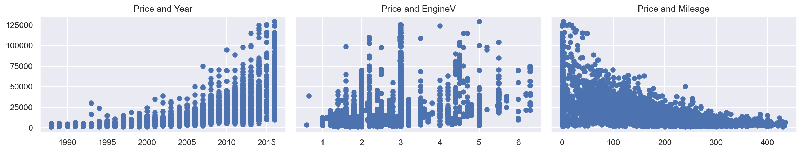
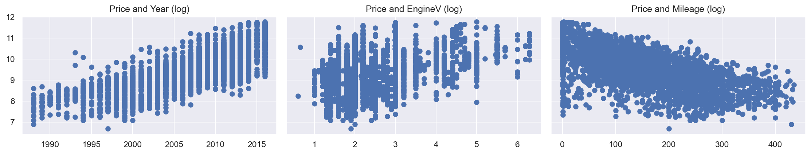
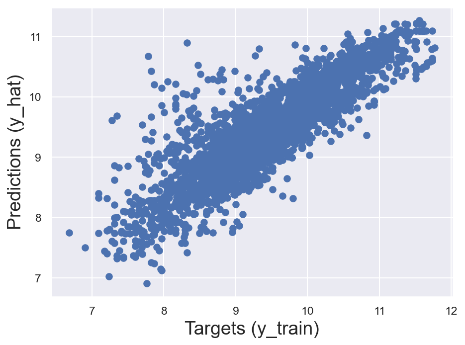
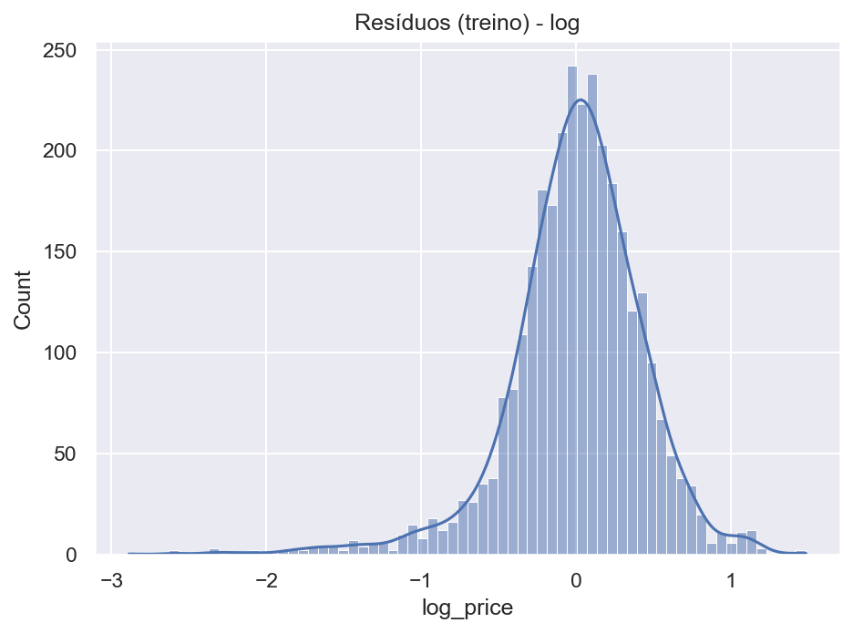
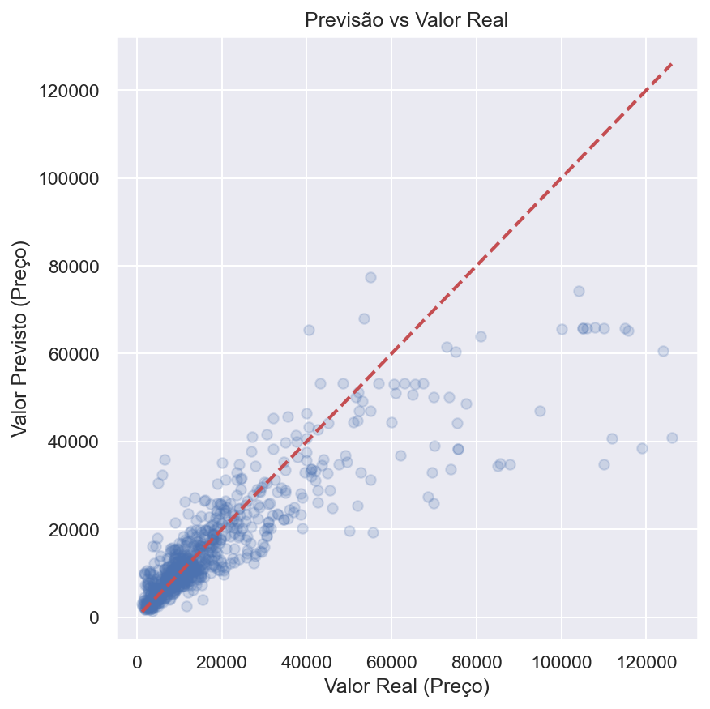

# Regressão Linear Múltipla para Preço de Carros

Este repositório contém minha primeira implementação de um modelo de regressão linear múltipla para estimar preços de carros com base em características como marca, tipo de carroceria, motor, quilometragem, ano etc. O modelo foi realizado a partir do Data Science Bootcamp da 365Data Science.

## Objetivos
- Explorar os dados e entender variáveis que mais afetam o preço.
- Aplicar limpeza e tratamento de outliers.
- Transformar o preço para escala logarítmica e interpretar coeficientes como variação percentual aproximada.
- Treinar, avaliar e interpretar o modelo.
- Documentar insights e próximos passos.

## Estrutura
```
src/
  linear_regression.py   # Script principal
notebooks/
  exploratory.ipynb      # EDA
reports/
  figures/               # Gráficos gerados
  model_summary.md       # Resumo OLS (statsmodels)
data/
  raw/                   # Dados originais
```

## Pipeline Resumido
1. Carregar dados (`src/linear_regression.py`)
2. Limpar:
   - Remoção de nulos
   - Remoção de outliers (Price, Mileage, EngineV, Year)
3. Transformar:
   - Log do preço
   - Dummies para categóricas
4. Multicolinearidade:
   - VIF calculado e remoção de Year devido relação com Mileage
5. Treinamento:
   - `LinearRegression` do scikit-learn
6. Avaliação:
   - R² treino e teste
   - MAE e RMSE no espaço original (exp do log)
   - Gráficos (resíduos, previsão vs real)
7. Interpretação:
   - Coeficientes convertidos em % aproximado
   - Resumo estatístico via statsmodels

## Como Reproduzir
```bash
git clone https://github.com/felipetp-ctrl/multi-linear-regression-car-prices.git
cd multi-linear-regression-car-prices
pip install -r requirements.txt
python src/linear_regression.py
```
Para reproduzir em Google Colab, acesse aqui! [](https://colab.research.google.com/github/felipetp-ctrl/multi-linear-regression-car-prices/blob/main/notebooks/exploratory.ipynb)

## Resultados e Gráficos

### 1) Relações iniciais com o preço (escala original)
Este trio ajuda a ver tendências gerais e outliers antes da transformação logarítmica.


Principais pontos:
- Price vs Year: carros mais novos tendem a valer mais.
- Price vs EngineV: motores maiores tendem a ter preços mais altos, mas há dispersão.
- Price vs Mileage: maior quilometragem normalmente reduz preço.

---

### 2) Relações com o log do preço
Após log-transform, as relações ficam mais lineares e adequadas para regressão OLS.


Por que isso é útil:
- Reduz a assimetria do preço.
- Facilita a interpretação: coeficientes no log podem ser aproximados como variação percentual.

---

### 3) Ajuste no treino (log-space) e distribuição de resíduos
- À esquerda: quanto mais próximos da linha y=x, melhor o ajuste no conjunto de treino.
- À direita: resíduos de treino; idealmente centrados em 0 e aproximadamente simétricos.

<table>
  <tr>
    <td></td>
    <td></td>
  </tr>
</table>

Leituras:
- Padrões fortes nos resíduos indicam violações (ex.: não-linearidade, heterocedasticidade).
- Caudas muito longas podem indicar outliers remanescentes.

---

### 4) Teste: Preço real vs previsto (espaço original)
Gráfico de dispersão com linha de referência y=x para avaliar qualidade de previsão fora do treino.



O que observar:
- Pontos próximos da linha vermelha indicam boas previsões.
- Faixas sistematicamente acima/abaixo sugerem viés (super/subestimação) e motivam ajustes no modelo.

---

### 5) Resumo estatístico do modelo (statsmodels)
Para p-values, intervalos de confiança e R² ajustado, consulte:
- [Resumo OLS (statsmodels)](reports/model_summary.md)

O arquivo é gerado automaticamente pelo script após o treinamento.

## Principais Perguntas Respondidas
- Qual o efeito (aprox. percentual) de ser da marca X no preço, controlando por outros fatores?
- Qual a depreciação associada à quilometragem?
- Qual o “premium” de motor maior (EngineV)?
- Registro (sim/não) agrega valor?
- Quais variáveis apresentam maior peso e quais poderiam ser adicionadas?

## Próximos Passos
- Adicionar validação cruzada.
- Testar modelagem com Ridge/Lasso.
- Incluir diagnóstico de heterocedasticidade (Breusch-Pagan).
- Calcular intervalos de confiança dos coeficientes.
- Comparar com modelos baseados em árvore (Random Forest, XGBoost).

## Licença
MIT

## Contato
Estou sempre aberto para sugestões! Abra uma issue ou conecte-se comigo no [LinkedIn](https://www.linkedin.com/in/felipetpereira/).
